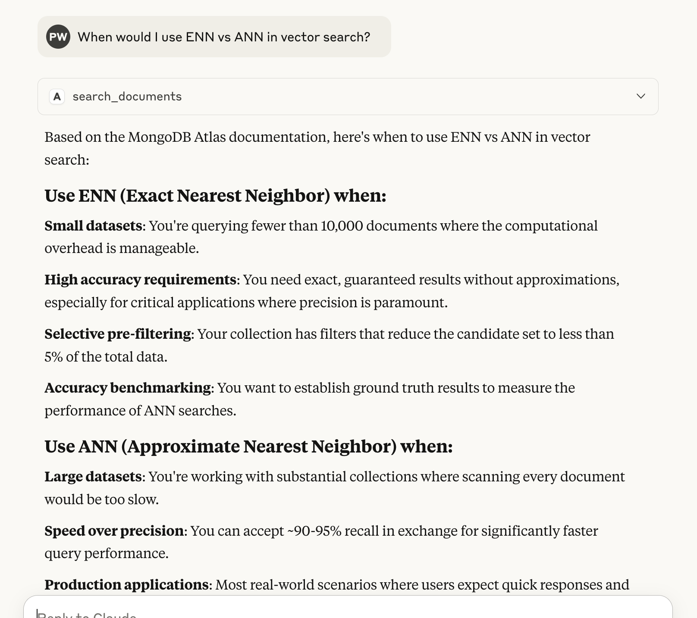

# MCP Document Search System

A vector search system for document retrieval using MongoDB Atlas Vector Search and Voyage AI embeddings.

Sample data included is for Atlas Vector Search!

## Features

- Ingests and chunks markdown documents with hierarchical headers
- Generates embeddings using Voyage AI's contextual embeddings API
- Stores documents and embeddings in MongoDB with parent-child relationships
- Provides a FastMCP server for semantic document search
- Supports configurable vector dimensions and chunking strategies



## Prerequisites

- Python 3.10+
- MongoDB Atlas cluster with vector search enabled
- Voyage AI API key

## Installation

1. Clone the repository:
```bash
git clone https://github.com/patw/avs-document-search.git
cd avs-document-search
```

2. Install dependencies:
```bash
pip install -r requirements.txt
```

3. Create a `.env` file based on `sample.env` with your credentials

## Usage

1. Ingest documents in the docs/ directory:
```bash
python ingest_docs.py
```

2. Run the search server:
```bash
python avs-mcp.py
```

Running the search server won't do much, other than verify your MongoDB URI is correct, you will need to plug this MCP server into an MCP client like Claude Desktop.   Here's a sample config:

```json
{
  "mcpServers": {
    "Atlas Vector Search Docs": {
      "command": "uv",
      "args": [
        "run",
        "--with",
        "fastmcp, pymongo, requests",
        "fastmcp",
        "run",
        "<path to>/avs-docs-mcp/avs-mcp.py"
      ]
    }
  }
}
```

## Configuration

Copy `sample.env` to `.env` and Edit to configure:
- MongoDB connection string
- Database and collection names
- Voyage AI API key
- Vector dimensions (256 default)

## Future Improvements

- Implement hybrid search combining vector and text search using `$rankFusion`
- Add Parent Document Retrieval to return full documents containing relevant chunks
- Support additional file formats (PDF, Word, etc.)
- Add authentication and rate limiting to the MCP server
- Implement caching for frequent queries
- Add monitoring and logging

## Contributing

Pull requests are welcome! For major changes, please open an issue first.

## Author

Pat Wendorf  
[pat.wendorf@mongodb.com](mailto:pat.wendorf@mongodb.com)  
GitHub: [patw](https://github.com/patw)

## License

[MIT](https://choosealicense.com/licenses/mit/)
